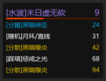
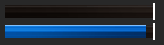
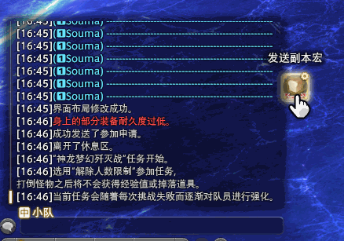
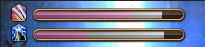
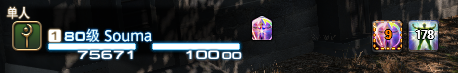
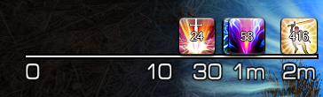
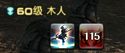
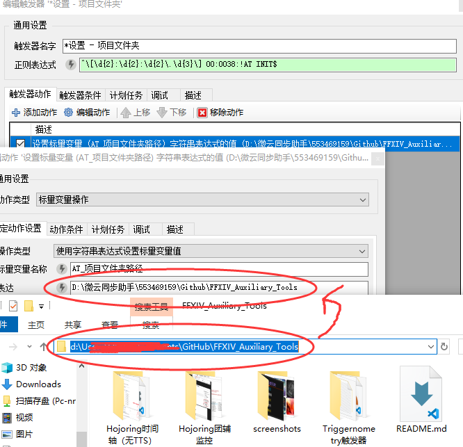
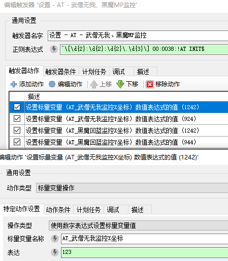

# FFXIV_Auxiliary_Tools (FF14 轮椅辅助工具)

    BUG反馈/交流群:868116069

1. [关于](#关于)

1. [安装过程](#安装过程)

1. [自定义](#自定义)

## 关于

此项目是依赖于ACT的 [最终幻想14](http://ff.sdo.com/) 副本辅助工具。

提供以下功能:

* Hojoring - 技能监控 :

* Hojoring - 时间轴:

* Triggernometry - 武僧无我/黑魔回蓝监控

* Triggernometry - 副本发宏工具

* Triggernometry - 队友技能监控

没图...
<!--  -->

* Triggernometry - 副本触发器

没图...

* Triggernometry - Zeff - 可视化Buff跟踪器

* Triggernometry - Zeff - 可视化DoT计时器

* Triggernometry - Zeff - 可视化队友冷却

* Triggernometry - Zeff - 可视化冷却跟踪器

* Triggernometry - Zeff - 可视化团辅冷却

### 视频示例

* [待更新...](http://)

## 安装过程

### 依赖

你必须启用 [DirectX 11](https://support.microsoft.com/zh-cn/help/179113/how-to-install-the-latest-version-of-directx) 来运行 最终幻想14

安装64位版本的 ACT
[原版](http://advancedcombattracker.com/) /
[国服适配整合版](https://nga.178.com/read.php?tid=17412506) /
[国服非绿色化整合](https://nga.178.com/read.php?tid=19019884)

加载FF14解析插件 (双整合版均自带) [国服原版ACT](https://github.com/TundraWork/FFXIV_ACT_Plugin_CN/releases),
[国际服](https://github.com/ravahn/FFXIV_ACT_Plugin/releases/latest)
的最新版本，启用网络解析，并确保没有防火墙或安全软件阻止ACT。并勾选解析设置中的"解析日止包含HP值" (Include HP for Triggers)

Hojoring插件
[Github](https://github.com/anoyetta/ACT.Hojoring)

Triggernometry插件
[Github](https://github.com/paissaheavyindustriesTriggernometry)

设置战斗间隔为50秒以上

确保游戏中聊天框的消息没有被过滤（重要）
[视频演示](https://www.bilibili.com/video/av83704576/)

### 组装轮椅

1. 下载 [最新版本](https://github.com/553469159/FFXIV_Auxiliary_Tools/archive/master.zip)

1. 右键压缩文件，点击属性，选中“解除锁定” (如果有)

1. 解压缩至任意路径

#### Hojoring 技能监控

1. 如果ACT在运行中，关闭ACT

1. 拷贝 '...\Hojoring团辅监控\SpellIcon技能图标包' 文件夹到你的 `...\ACT.Hojoring\resources\icon\` 文件夹内

1. 启动ACT，在Hojoring特殊技能计时器(Hojoring-SPESPE)选项卡 - 触发器 - 左侧选项卡第二项'所有技能'，右键 **空白处** 选择导入 选择 `大技能.xml` ，同样方法导入 `团辅.xml`。

1. 点击技能组左侧的齿轮图标可以进入调试模式，进行位置的调整。

1. 如果想让所有图标都实时显示，需要在每一个技能中都选择 通用 - 队伍职业过滤 - 清除过滤

1. 可选操作：如果想实现预览图中一样的效果。在Hojoring特殊计时器 - 选项 -

    * 显示 - 设置 文字轮廓加粗率 = 1.7 文字模糊率 = 0 ;

    * 触发器 - 正向计时器完成时显示文字 与 反向计时器完成内显示文字 均设置为 空

#### Hojoring 时间轴

1. 拷贝 `...Hojoring时间轴\*.xml` 文件到 `...\ACT.Hojoring\resources\timeline\` 文件夹内

1. 如果ACT在运行中，Hojoring特殊技能计时器(Hojoring-SPESPE)选项卡 - 时间轴 - 点击Roload

1. 可选操作：在时间轴 - 设置 中配置你的自定义样式。

#### Triggernometry

1. 如果是第一次开启，会弹出欢迎界面，跳过。在右上角可以切换语言，以下说明以国服咖啡整合版ACT的简体中文翻译作为示范。

##### 导入到本地

1. 右键 本地触发器 选择 导入 选择 `...\Triggernometry触发器\5.0触发器\5.0触发器.xml`

1. 为了查看方便，右键 本地触发器 选择 折叠全部。

1. 展开 5.0轮椅 - *设置文件夹 进行设置：

   双击 *设置 - 项目文件夹 双击 设置变量 更改 表达的内容
    

1. 重启ACT，或在游戏中使用宏 `/e !AT INIT` 对刚才修改的内容进行设置。

#### 鲶鱼精邮差

1. 下载并运行 [鲶鱼精邮差](https://nga.178.com/read.php?tid=19724323)，方法不再赘述，帖子里也写了。

1. 找一个顺眼的，不被你电脑中其他程序占用的端口 开始监听。比如我默认设置为2019

1. 如果不是2019，在*设置文件夹 - "设置 - AT - 鲶鱼精邮差监听端口" 中设置成你监听的端口，并使设置生效。

## 自定义

### 关掉不需要的功能

在 5.0轮椅 - 功能 内取消勾选对应组 （而**不在**设置文件夹中）

### 修改某某功能的位置：

找到设置内对应的X坐标Y坐标的值进行修改

以无我监控为例

### 修改副本触发器的字幕样式

在 5.0轮椅 - 功能 - 副本触发器 - 内部方法 - 字幕提示 编辑文本Aura的属性 在第四行可以找到字体 点击小齿轮便可以进行颜色设置，右侧的浏览可以调整字体与字体大小与粗细。

### Hojoring时间轴背景

#### 背景样式设置

  一个透明无颜色的配置是#00000000  
  第1-2位是背景的不透明度的16进制,如果你想要透明50%(127),则为"7F"  
  第3-4位是颜色的R值的16进制  5-6位是G值的16进制 7-8位是B值的16进制  
  所以先找到一个喜欢的颜色，再将他们三位RGB值分别转换为十六进制即可。  
  例如你想要一个RGB(0,108,191)透明度为90%的蓝色背景，  
  设置则应该填入：#E6006CBF  
  [在线进制转换](https://tool.oschina.net/hexconvert/)

  [RGB颜色值与十六进制颜色码转换工具](https://www.sioe.cn/yingyong/yanse-rgb-16/)

#### 内部文字样式设置

  | 样式名 | 填充颜色  | 轮廓颜色  |
  |--------|-----------|-----------|
  | AoE    | #FF9370DB | #FF000000 |
  | 伤害   | #FFEDCA00 | #FF000000 |
  | 分摊   | #FF00B2ED | #FF000000 |
  | 死刑   | #FFE93F00 | #FF000000 |
