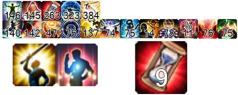

# FFXIV_Auxiliary_Tools (FF14 轮椅辅助工具)

* QQ群:868116069
  * [提问的智慧](https://github.com/ryanhanwu/How-To-Ask-Questions-The-Smart-Way/blob/master/README-zh_CN.md)
  * [别像弱智一样提问](https://github.com/dogfight360/Stop-Ask-Questions-The-Stupid-Ways/blob/master/README.md)

1. [关于](#关于)
1. [安装过程](#安装过程)
1. [自定义](#自定义)
1. [杂项说明](#杂项说明)

## 关于

此项目是依赖于ACT的 [最终幻想14](http://ff.sdo.com/) 副本辅助工具

提供以下功能:

* Hojoring - 技能监控 :
  

* Hojoring - 时间轴:
  
  
* Triggernometry - 武僧无我/黑魔回蓝监控
  

* Triggernometry - 副本发宏工具
  

* Triggernometry - 队友技能监控
  没图...
* Triggernometry - 副本触发器
  没图...
* Triggernometry - Zeff - 可视化Buff跟踪器
  

* Triggernometry - Zeff - 可视化DoT计时器
  

* Triggernometry - Zeff - 可视化队友冷却
  

* Triggernometry - Zeff - 可视化冷却跟踪器
  

* Triggernometry - Zeff - 可视化团辅冷却
  

* Triggernometry - Aho's Raid Buff
  

## 安装过程

### 依赖

1. 你必须启用 [DirectX 11](https://support.microsoft.com/zh-cn/help/179113/how-to-install-the-latest-version-of-directx) 来运行 最终幻想14
1. 安装64位版本的 ACT
[原版](http://advancedcombattracker.com/) /
[国服适配整合版](https://nga.178.com/read.php?tid=17412506) /
[国服非绿色化整合](https://nga.178.com/read.php?tid=19019884)
1. 加载FF14解析插件 整合版自带 /
[国服原版ACT](https://github.com/TundraWork/FFXIV_ACT_Plugin_CN/releases)/
[国际服](https://github.com/ravahn/FFXIV_ACT_Plugin/releases/latest)
的最新版本，启用网络解析，并确保没有防火墙或安全软件阻止ACT。并勾选解析设置中的"解析日止包含HP值" (Include HP for Triggers)
1. 加载 [Hojoring](https://github.com/anoyetta/ACT.Hojoring)
[Triggernometry](https://github.com/paissaheavyindustriesTriggernometry)
1. **确保游戏中聊天框的消息没有被过滤（重要）**
[设置过滤 - 视频演示](https://www.bilibili.com/video/av83704576/)
1. 设置战斗间隔为50秒以上

### 组装轮椅

1. 下载 [最新版本](https://github.com/553469159/FFXIV_Auxiliary_Tools/archive/master.zip)
1. 右键压缩文件，点击属性，选中“解除锁定” (如果有)
1. 解压缩至任意路径

#### Hojoring 技能监控

1. 如果ACT在运行中，关闭ACT
1. 拷贝 `...\Hojoring团辅监控\SpellIcon技能图标包` 文件夹到你的 `...\ACT.Hojoring\resources\icon\` 文件夹内
1. 启动ACT，在Hojoring特殊技能计时器(Hojoring-SPESPE)选项卡 - 触发器 - 左侧选项卡第二项'所有技能'，右键 **空白处** 选择导入 选择 `大技能.xml` ，同样方法导入 `团辅.xml`
1. 点击技能组左侧的齿轮图标可以进入调试模式，进行位置的调整
1. 可选操作：如果想让所有图标都实时显示，需要在每一个技能中都选择 通用 - 队伍职业过滤 - 清除过滤
1. 可选操作：如果想实现预览图中一样的效果。在Hojoring特殊计时器 - 选项 -
    * 显示 - 设置 文字轮廓加粗率 = 1.7 文字模糊率 = 0
    * 触发器 - 正向计时器完成时显示文字 与 反向计时器完成内显示文字 均设置为 空

#### Hojoring 时间轴

1. 拷贝 `...Hojoring时间轴\*.xml` 文件到 `...\ACT.Hojoring\resources\timeline\` 文件夹内
1. 如果ACT在运行中，Hojoring特殊技能计时器(Hojoring-SPESPE)选项卡 - 时间轴 - 点击Roload
1. 可选操作：在时间轴 - 设置 中配置 [自定义样式](#背景样式设置)

#### Triggernometry

1. **以管理员身份运行** `添加当前目录到环境变量.bat`
  
1. 出现这个字样代表成功
  
1. 在 Triggernometry中 右键 本地触发器 选择 导入 选择 `...\Triggernometry触发器\5.0触发器\5.0触发器.xml`
1. 可选：在 自定义设置 中 进行一些设置，比如坐标位置调整。

##### 鲶鱼精邮差

1. 下载并运行 [鲶鱼精邮差](https://nga.178.com/read.php?tid=19724323)
1. 找一个端口 开始监听。比如我默认设置为2019
1. 如果不是2019，在 自定义设置- AT - 鲶鱼精邮差监听端口 修改为你监听的端口

## 自定义

### 修改某某功能的位置

* 找到设置内对应的X坐标Y坐标的值进行修改，以武僧无我监控为例
  

### 修改副本触发器的字幕样式

* 在 5.0轮椅 - 原功能 - 副本触发器 - 内部方法 - 字幕提示 编辑文本Aura的属性 在第四行可以找到字体 点击小齿轮便可以进行颜色设置，右侧的 浏览 可以调整字体与字体大小与粗细
  

### 触发器改自定义语音包

* 

### 让Triggernometry触发器使用ACT的TTS插件

* 

### Hojoring时间轴背景

#### 背景样式设置

* 一个透明无颜色的配置是#00000000  
  第1-2位是背景的不透明度的16进制,如果你想要透明50%(127),则为"7F"  
  第3-4位是颜色的R值的16进制  5-6位是G值的16进制 7-8位是B值的16进制  

  例如你想要一个RGB(0,108,191)透明度为90%的蓝色背景，  
  设置则应该填入：#E6006CBF  

  [在线进制转换](https://tool.oschina.net/hexconvert/)

  [RGB颜色值与十六进制颜色码转换工具](https://www.sioe.cn/yingyong/yanse-rgb-16/)

#### 内部文字样式设置

* 预览图中的设置

  | 样式名 | 填充颜色  | 轮廓颜色  |
  |--------|-----------|-----------|
  | AoE    | #FF9370DB | #FF000000 |
  | 伤害   | #FFEDCA00 | #FF000000 |
  | 分摊   | #FF00B2ED | #FF000000 |
  | 死刑   | #FFE93F00 | #FF000000 |

## 杂项说明

* 设置E4S职能位置
  

* 触发器延迟 原因非常多，不保证解决，毕竟**圆明园不是我烧的**。

  * 尝试更改ACT的CPU优先级
    

  * 减少各种其他资源占用
    * **关闭不需要的触发器组**
    * 关闭后台软件
    * 对游戏进行锁帧
    * 降低画面显示效果

  * ~~加钱上i9-10980XE + Titan RTX~~
