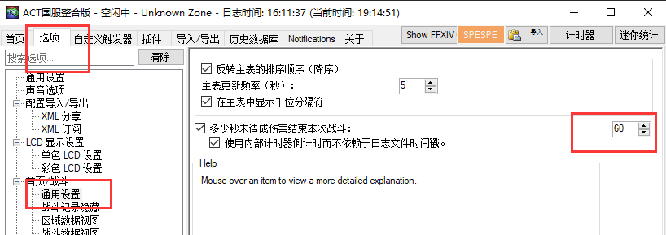
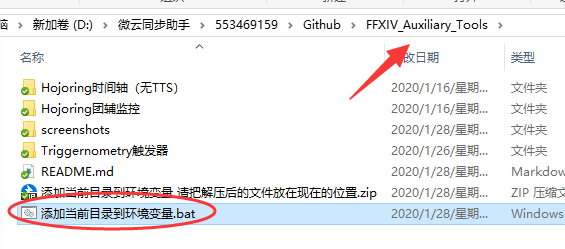
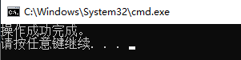
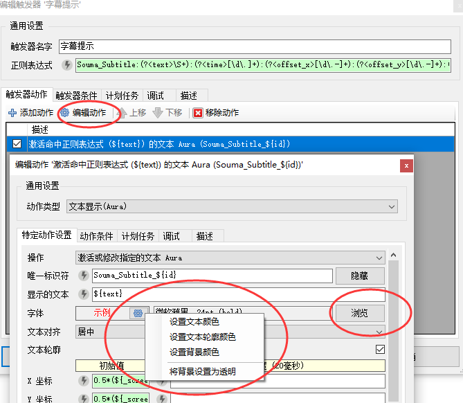
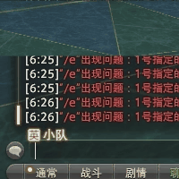

# FFXIV_Auxiliary_Tools

* QQ群:868116069
  * [提问的智慧](https://github.com/ryanhanwu/How-To-Ask-Questions-The-Smart-Way/blob/master/README-zh_CN.md)
  * [别像Stupid一样提问](https://github.com/dogfight360/Stop-Ask-Questions-The-Stupid-Ways/blob/master/README.md)
  * [如何优雅的提问](http://www.360doc.com/content/19/1223/08/30422483_881502108.shtml)

## 自助排障

  1. 导入`Triggernometry触发器\Test.xml`
  1. 前往"中拉诺西亚-盛夏农庄"
  1. 对木人 “行礼” 进行测试 
  
  1. 正常状态
  1. 对木人 “告别” 以提前关闭窗口
  
## 基础依赖

  1. 启用 DirectX 11
  1. 安装 [ACT呆萌整合](https://nga.178.com/read.php?tid=19019884) / [Triggernometry](https://github.com/paissaheavyindustries/Triggernometry)
  1. **聊天框的消息没有被过滤** [视频演示](https://www.bilibili.com/video/av83704576/)
  1. 设置ACT战斗间隔为60秒以上 

## 配置 Triggernometry 环境

1. **以管理员身份运行** `添加触发器目录与鲶鱼精邮差端口到环境变量.bat`

   

1. 出现这个字样代表成功
  
   
1. **重新启动ACT**

### 鲶鱼精邮差

1. 下载并运行 [鲶鱼精邮差](https://nga.178.com/read.php?tid=19724323)
1. 找一个端口 开始监听。比如2019
1. 如果不是2019，在 Bat右键编辑 倒数第二行 修改为你监听的端口并保存
1. **以管理员身份运行** bat
1. **重新启动ACT**

   

## 自定义项目

### 修改副本触发器的字幕样式

* 在 “副本触发器 - Func - 字幕提示” 的内部，编辑 “文本Aura” 的属性 可以修改字体的样式
  

### 触发器改自定义语音包

* 

### 让Triggernometry触发器使用ACT的TTS插件

* 

## 杂项说明

* 如果Triggernometry的_ffixvplayer方法失效，可以尝试取消其自定义职业排序

* 如何设置职能位置
  

* 触发器延迟
  * 关闭不需要的触发器组
  * 没开`鲶鱼精邮差`的时候**不要启用**需要邮差的触发器
  * 尝试更改ACT的CPU优先级
    

## 说明

  Aho与Zeff触发器是国际服触发器汉化而来，非原创。

  Aho触发器 by Aho Senpai (Discord: Aho Senpai#0818).

  Zeff触发器 by Zeffuro (Discord: Zeffuro#3033)
