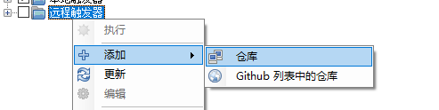
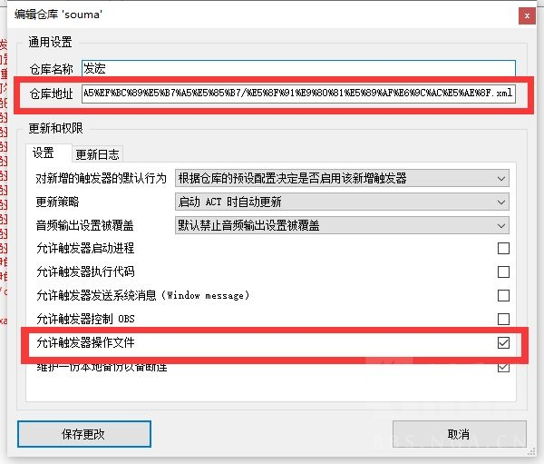

# FFXIV_Auxiliary_Tools

* QQ群:868116069
  * [提问前请看](http://www.360doc.com/content/19/1223/08/30422483_881502108.shtml)
  
* 下载分流
  * [Github](https://github.com/553469159/FFXIV_Auxiliary_Tools)
  * [Gitee](https://gitee.com/soumasumire/FFXIV_Auxiliary_Tools)

* 部分触发器依赖 [鲶鱼精邮差](https://nga.178.com/read.php?tid=19724323)

## 基础依赖

  1. 启用 DirectX 11 运行 最终幻想14
  1. 安装 [ACT呆萌整合](https://nga.178.com/read.php?tid=19019884) / [FFCafe国服整合](https://ffcafe.org/act/) / [Triggernometry](https://github.com/paissaheavyindustries/Triggernometry)
  1. **聊天框消息没有被过滤** [视频演示](https://www.bilibili.com/video/av83704576/)

## 导入触发器




远程仓库地址：

```仓库地址:
5.0副本触发器
https://gitee.com/soumasumire/FFXIV_Auxiliary_Tools/raw/master/Triggernometry%E8%A7%A6%E5%8F%91%E5%99%A8/%E5%89%AF%E6%9C%AC%E8%A7%A6%E5%8F%91%E5%99%A8/5.0%E8%A7%A6%E5%8F%91%E5%99%A8.xml

配置【鲶鱼精邮差】监听端口（导入时需勾选“允许触发器启动进程”）
//复制到本地以修改端口
//已经下载到本地的可以也选择运行'设置鲶鱼精邮差端口.bat'进行设置
https://gitee.com/soumasumire/FFXIV_Auxiliary_Tools/raw/master/Triggernometry%E8%A7%A6%E5%8F%91%E5%99%A8/%E9%85%8D%E7%BD%AE%E9%B2%B6%E9%B1%BC%E7%B2%BE%E9%82%AE%E5%B7%AE%E7%AB%AF%E5%8F%A3.xml

Aho 团辅监控
https://gitee.com/soumasumire/FFXIV_Auxiliary_Tools/raw/master/Triggernometry%E8%A7%A6%E5%8F%91%E5%99%A8/Aho%E5%9B%A2%E8%BE%85%E7%9B%91%E6%8E%A7/Aho's%20Raid%20Buffs.xml

Zeffuro's Trigger Repository 精致的各种监控
https://gitee.com/soumasumire/FFXIV_Auxiliary_Tools/raw/master/Triggernometry%E8%A7%A6%E5%8F%91%E5%99%A8/Zeffuro's%20Trigger%20Repository%20%E5%9B%BD%E6%9C%8D%E7%8E%AF%E5%A2%83%E9%80%82%E9%85%8D.xml

副本发宏工具 （导入时需勾选“允许触发器操作文件”）
https://gitee.com/soumasumire/FFXIV_Auxiliary_Tools/raw/master/Triggernometry%E8%A7%A6%E5%8F%91%E5%99%A8/%E5%89%AF%E6%9C%AC%E5%8F%91%E5%AE%8F%EF%BC%88%E5%8F%91%E6%94%BB%E7%95%A5%EF%BC%89%E5%B7%A5%E5%85%B7/%E5%8F%91%E9%80%81%E5%89%AF%E6%9C%AC%E5%AE%8F.xml

FF14信用查询（导入时需勾选“允许触发器操作文件”）
https://gitee.com/soumasumire/FFXIV_Auxiliary_Tools/raw/master/Triggernometry%E8%A7%A6%E5%8F%91%E5%99%A8/%E4%BF%A1%E7%94%A8%E6%9F%A5%E8%AF%A2/FF14%E4%BF%A1%E7%94%A8%E6%9F%A5%E8%AF%A2.xml

队伍监控 （使用时需开启【鲶鱼精邮差】）
https://gitee.com/soumasumire/FFXIV_Auxiliary_Tools/raw/master/Triggernometry%E8%A7%A6%E5%8F%91%E5%99%A8/%E9%98%9F%E4%BC%8D%E7%9B%91%E6%8E%A7.xml

施法监控
https://gitee.com/soumasumire/FFXIV_Auxiliary_Tools/raw/master/Triggernometry%E8%A7%A6%E5%8F%91%E5%99%A8/%E6%96%BD%E6%B3%95%E7%9B%91%E6%8E%A7.xml

寻找
https://gitee.com/soumasumire/FFXIV_Auxiliary_Tools/raw/master/Triggernometry%E8%A7%A6%E5%8F%91%E5%99%A8/%E5%AF%BB%E6%89%BE.xml

OBS自动录制
https://gitee.com/soumasumire/FFXIV_Auxiliary_Tools/raw/master/Triggernometry%E8%A7%A6%E5%8F%91%E5%99%A8/OBS%E8%87%AA%E5%8A%A8%E5%BD%95%E5%88%B6.xml

一键占星出卡（使用时需开启【鲶鱼精邮差】）（导入时需勾选“允许触发器操作文件”）
https://gitee.com/soumasumire/FFXIV_Auxiliary_Tools/raw/master/Triggernometry%E8%A7%A6%E5%8F%91%E5%99%A8/%E4%B8%80%E9%94%AE%E7%B3%BB%E5%88%97/%E5%8D%A0%E6%98%9F%E4%B8%80%E9%94%AE%E5%8F%91%E5%8D%A1/AstAutoCard.xml

一键跳舞（使用时需开启【鲶鱼精邮差】）
https://gitee.com/soumasumire/FFXIV_Auxiliary_Tools/raw/master/Triggernometry%E8%A7%A6%E5%8F%91%E5%99%A8/%E4%B8%80%E9%94%AE%E7%B3%BB%E5%88%97/%E8%88%9E%E8%80%85%E4%B8%80%E9%94%AE%E8%B7%B3%E8%88%9E.xml

一键DK（使用时需开启【鲶鱼精邮差】）
https://gitee.com/soumasumire/FFXIV_Auxiliary_Tools/raw/master/Triggernometry%E8%A7%A6%E5%8F%91%E5%99%A8/%E4%B8%80%E9%94%AE%E7%B3%BB%E5%88%97/%E6%9A%97%E9%AA%91GCD%E4%B8%80%E9%94%AE%E5%BE%AA%E7%8E%AF.xml

一键武僧（使用时需开启【鲶鱼精邮差】）
https://gitee.com/soumasumire/FFXIV_Auxiliary_Tools/raw/master/Triggernometry%E8%A7%A6%E5%8F%91%E5%99%A8/%E4%B8%80%E9%94%AE%E7%B3%BB%E5%88%97/%E6%AD%A6%E5%83%A7GCD%E4%B8%80%E9%94%AE%E5%BE%AA%E7%8E%AF.xml

两键龙骑（使用时需开启【鲶鱼精邮差】）
https://gitee.com/soumasumire/FFXIV_Auxiliary_Tools/raw/master/Triggernometry%E8%A7%A6%E5%8F%91%E5%99%A8/%E4%B8%80%E9%94%AE%E7%B3%BB%E5%88%97/%E9%BE%99%E9%AA%91GCD%E4%B8%A4%E9%94%AE%E5%BE%AA%E7%8E%AF.xml

MP Server Tick
https://gitee.com/soumasumire/FFXIV_Auxiliary_Tools/raw/master/Triggernometry%E8%A7%A6%E5%8F%91%E5%99%A8/%E8%B7%B3%E8%93%9D%E3%80%81%E6%97%A0%E6%88%91%E3%80%81Dot%E5%88%A4%E5%AE%9A/%E5%9B%9E%E8%93%9D.xml

```

## 让Triggernometry触发器使用ACT的TTS插件

* 

## 其他说明

* 如果Triggernometry的_ffixvplayer方法失效，可以尝试取消其自定义职业排序
* 触发器延迟
  * 关闭不需要的触发器组
  * 没开`鲶鱼精邮差`的时候**不要启用**需要邮差的触发器
  * 尝试更改ACT的CPU优先级
* Aho是国际服触发器汉化而来，非原创。@Discord: Aho Senpai#0818
