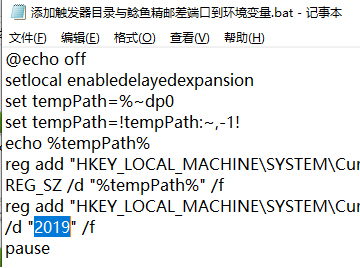

# 一键系列

## 基础依赖

1. 你必须启用 [DirectX 11](https://support.microsoft.com/zh-cn/help/179113/how-to-install-the-latest-version-of-directx) 来运行 最终幻想14
1. 安装64位版本的 ACT [呆萌整合](https://nga.178.com/read.php?tid=19019884)
1. 安装 [Triggernometry](https://github.com/paissaheavyindustries/Triggernometry)
1. **确保游戏中聊天框的消息没有被过滤**
[设置过滤 - 视频演示](https://www.bilibili.com/video/av83704576/)

### 如初次使用，打木桩测试时，请使用1次倒计时进行键位初始化

### 配置环境 （使用任何触发器，我都默认你是做过这步的）

1. **以管理员身份运行** `添加触发器目录与鲶鱼精邮差端口到环境变量.bat`

   

1. 出现这个字样代表成功
  
   
1. **重新启动ACT**

### 鲶鱼精邮差（使用任何触发器，我都默认你是做过这步的）

1. 下载并运行 [鲶鱼精邮差](https://nga.178.com/read.php?tid=19724323)
1. 找一个端口 开始监听。比如2019
1. 如果不是2019，在 Bat右键编辑 倒数第二行 修改为你监听的端口并保存

   
1. **以管理员身份运行** bat
1. **重新启动ACT**
